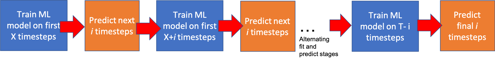

# ml-iter-additive
This software provides the code for an iterative machine learning framework that uses extremely randomized trees (also known as extreme random forests) for predicting temperature profiles in an additive manufacturing process. 

  

Requirements:

* Scikit-Learn 0.19.1
* Numpy 1.14
* Pandas 0.22
* XGBoost 0.7 or higher

## Files

#### Core Files
- additive_util.py: Core utility file for this repository (including incorporating neighbor information) 
- create_db_iter_ml.py: Utility file for creating database for iterative modeling 
- predict_additive.py : Utility and test file for machine learning on additive Data 

#### Notebooks
- analyze&prepare_data.ipynb: Analyze the FEM data and convert it into a structured dataset 
- prepare_neighbor_info.ipynb: Develop and test functions for incorporating neighbor information 
- predict_noniterative.ipynb: Explore ML models for non-iterative (standard) approach 
- predict_iterative.ipynb: Explore ML models for iterative approach 
- stacked_rnn.ipynb: The stacked RNN approach (used in Manufacturing Letters work) 

## Data 

The prepared dataset is available at https://www.dropbox.com/s/vr0yqz0rcufamgs/data_iterative.csv?dl=0 

## Citation

If you use this code or data, please cite:

A. Paul, M.Mozaffar, Z. Yang, W. Liao, A. Choudhary, J. Cao and A. Agrawal. A real-time iterative approach for temperature profile prediction in additive manufacturing processes. 6th IEEE International Conference on Data Science and Advanced Analytics (DSAA), 2019

## Developer Team & Collaborators 

The code was developed by the <a href="http://cucis.ece.northwestern.edu/">CUCIS</a> group at the Electrical and Computer Engineering Department in Northwestern University. The development team would like thank the collaborators at Northwestern's <a href="http://ampl.mech.northwestern.edu/">Advanced Manufacturing Processes Laboratory</a>. 

## Questions/Comments

email: arindam.paul@eecs.northwestern.edu or ankitag@eecs.northwestern.edu 
Copyright (C) 2019, Northwestern University. 
See COPYRIGHT notice in top-level directory.

## Funding Support

This work was performed under the following financial assistance award 70NANB19H005 from U.S. Department of Commerce, National Institute of Standards and Technology as part of the Center for Hierarchical Materials Design (CHiMaD). Partial support is also acknowledged from DOE awards DE-SC0014330, DE-SC0019358.
